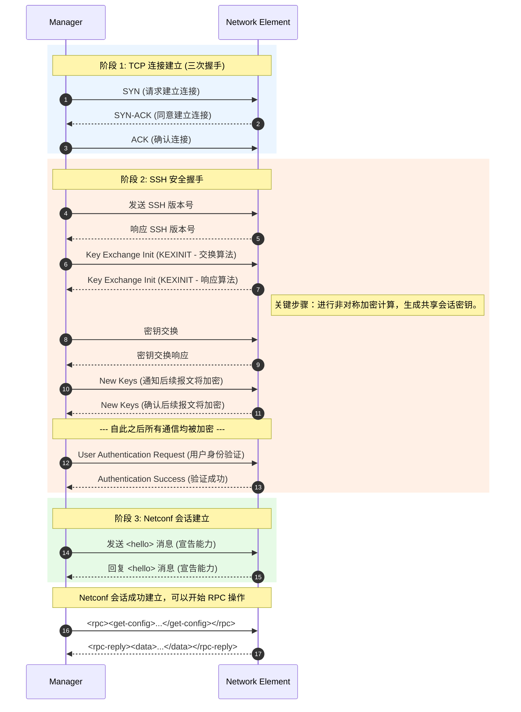

---
source:
author:
published:
created:
description:
tags:
  - ssh
  - netconf
---

# Netconf 连接过程

```mermaid
sequenceDiagram
    autonumber
    participant Manager
    participant Network Element

    rect rgb(235, 245, 255)
        note over Manager, Network Element: 阶段 1: TCP 连接建立 (三次握手)
        Manager->>Network Element: SYN (请求建立连接)
        Network Element-->>Manager: SYN-ACK (同意建立连接)
        Manager->>Network Element: ACK (确认连接)
    end

    rect rgb(255, 240, 230)
        note over Manager, Network Element: 阶段 2: SSH 安全握手
        Manager->>Network Element: 发送 SSH 版本号
        Network Element-->>Manager: 响应 SSH 版本号
        Manager->>Network Element: Key Exchange Init (KEXINIT - 交换算法)
        Network Element-->>Manager: Key Exchange Init (KEXINIT - 响应算法)
        
        note right of Network Element: 关键步骤：进行非对称加密计算，生成共享会话密钥。
        Manager->>Network Element: 密钥交换
        Network Element-->>Manager: 密钥交换响应

        Manager->>Network Element: New Keys (通知后续报文将加密)
        Network Element-->>Manager: New Keys (确认后续报文将加密)
        
        note over Manager, Network Element: --- 自此之后所有通信均被加密 ---
        
        Manager->>Network Element: User Authentication Request (用户身份验证)
        Network Element-->>Manager: Authentication Success (验证成功)
    end

    rect rgb(230, 250, 230)
        note over Manager, Network Element: 阶段 3: Netconf 会话建立
        Manager->>Network Element: 发送 <hello> 消息 (宣告能力)
        Network Element-->>Manager: 回复 <hello> 消息 (宣告能力)
    end

    note over Manager, Network Element: Netconf 会话成功建立，可以开始 RPC 操作
    Manager->>Network Element: <rpc><get-config>...</get-config></rpc>
    Network Element-->>Manager: <rpc-reply><data>...</data></rpc-reply>
```
